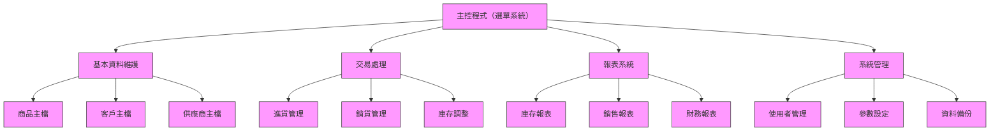
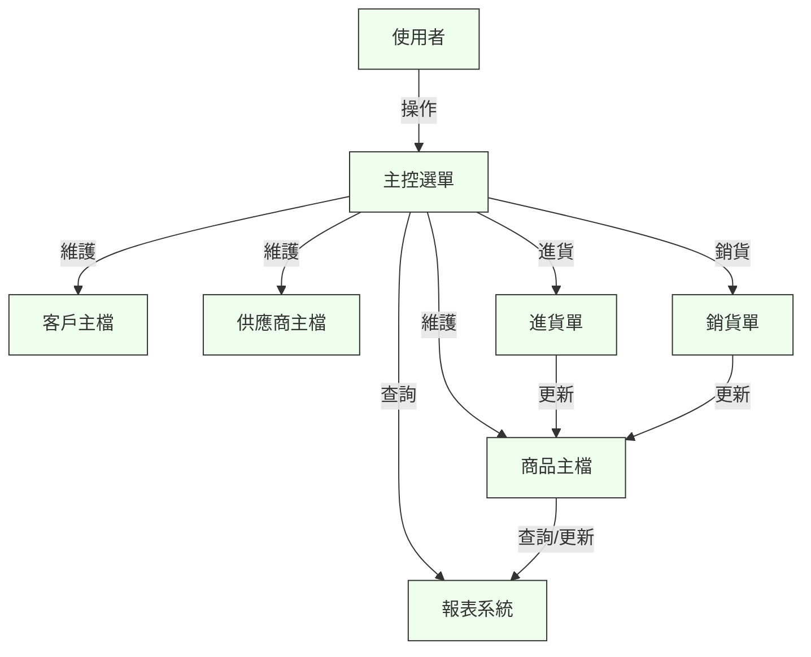

# 第十二週：實戰專案 - 企業進銷存系統

## 📚 專案目標

- 綜合應用前11週所學，獨立完成一套企業級進銷存管理系統（Inventory & Sales System）。
- 培養完整專案開發、系統整合、文件撰寫與測試驗證能力。
- 體驗真實企業專案開發流程，提升職場競爭力。

---

## 🏗️ 系統架構設計



---

## 📈 商品流轉流程圖


---

## 🗺️ 資料流圖（DFD）



---

## 🗃️ 商品主檔ERD（實體關聯圖）

```mermaid
erDiagram
    ITEMS ||--o{ PURCHASES : "被進貨"
    ITEMS ||--o{ SALES : "被銷售"
    CUSTOMERS ||--o{ SALES : "下訂單"
    SUPPLIERS ||--o{ PURCHASES : "供應"
    ITEMS {
        CHAR(10) ITEM_ID PK
        VARCHAR(30) ITEM_NAME
        CHAR(4) UNIT
        DECIMAL(9,2) PRICE
        DECIMAL(9,2) COST
        DECIMAL(9,2) STOCK_QTY
        CHAR(1) STATUS
    }
    CUSTOMERS {
        CHAR(10) CUST_ID PK
        VARCHAR(30) CUST_NAME
        VARCHAR(20) TEL
        VARCHAR(50) ADDRESS
        CHAR(1) STATUS
    }
    SUPPLIERS {
        CHAR(10) SUPP_ID PK
        VARCHAR(30) SUPP_NAME
        VARCHAR(20) TEL
        VARCHAR(50) ADDRESS
        CHAR(1) STATUS
    }
    PURCHASES {
        CHAR(12) PUR_ID PK
        CHAR(10) SUPP_ID FK
        DATE DATE
        DECIMAL(11,2) AMOUNT
    }
    SALES {
        CHAR(12) SALE_ID PK
        CHAR(10) CUST_ID FK
        DATE DATE
        DECIMAL(11,2) AMOUNT
    }
```

---

## 📝 功能需求

### 1. 主控選單
- 提供各模組進入點，支援功能鍵快速切換。

### 2. 基本資料維護
- 商品主檔：新增/查詢/修改/刪除商品資料。
- 客戶主檔：管理客戶基本資料。
- 供應商主檔：管理供應商資料。

### 3. 交易處理
- 進貨管理：登錄進貨單、更新庫存。
- 銷貨管理：登錄銷貨單、扣減庫存、產生發票。
- 庫存調整：手動調整庫存數量，記錄異動原因。

### 4. 報表系統
- 庫存報表：查詢各商品即時庫存。
- 銷售報表：統計各時段銷售數據。
- 財務報表：彙總進銷貨金額、毛利等。

### 5. 系統管理
- 使用者管理：帳號新增、權限設定、密碼變更。
- 參數設定：稅率、單位、預設值等。
- 資料備份：定期備份重要資料。

---

## 🛠️ 開發步驟建議

### 1. 需求確認與系統設計
- **案例說明：**
  - 以「商品進貨與銷售」為主線，繪製商品流轉流程圖（如：進貨→入庫→銷售→出庫→庫存調整）。
  - 針對「商品主檔」設計ERD（實體關聯圖），明確欄位、主鍵、關聯。
- **操作指引：**
  - 與同儕討論需求，列出所有功能清單。
  - 使用紙本或線上工具（如draw.io）繪製資料流圖與系統架構圖。
  - 撰寫簡要需求規格書，明確每個模組的輸入、處理、輸出。

### 2. 主控選單與基本模組開發
- **案例說明：**
  - 先開發一個「主選單」程式，提供1.商品維護、2.客戶維護、3.進貨處理、4.銷貨處理、5.報表查詢、0.結束等選項。
  - 商品主檔維護程式：可新增、查詢、修改、刪除商品。
- **操作指引：**
  - 使用PERFORM結構設計主控流程。
  - 每個功能模組獨立成段落或子程式，便於日後擴充。
  - 先完成商品主檔CRUD，測試無誤後再加入客戶、供應商模組。

### 3. 交易處理與庫存邏輯
- **案例說明：**
  - 進貨處理：輸入進貨單號、商品編號、數量、單價，系統自動更新商品庫存。
  - 銷貨處理：輸入銷貨單號、商品編號、數量，系統自動扣減庫存，若庫存不足則顯示錯誤訊息。
  - 庫存調整：可手動修正庫存數量，並記錄異動原因。
- **操作指引：**
  - 設計「庫存檢查」子程式，於銷貨時自動檢查庫存。
  - 每次交易後，立即更新商品主檔的STOCK_QTY欄位。
  - 所有異動須寫入交易明細檔，方便日後追蹤。

### 4. 報表與查詢功能
- **案例說明：**
  - 庫存報表：列出所有商品的即時庫存，並可依商品名稱、庫存量篩選。
  - 銷售報表：統計某一時段（如本月）各商品銷售數量與金額。
  - 財務報表：彙總進貨、銷貨、毛利等資訊。
- **操作指引：**
  - 使用EVALUATE或SQL聚合函數設計分組統計。
  - 報表支援分頁顯示與匯出（如PDF、CSV）。
  - 報表程式與主控選單整合，方便操作。

### 5. 系統管理與驗證
- **案例說明：**
  - 使用者管理：新增帳號、設定權限（如：管理員、操作員），密碼變更。
  - 參數設定：可調整稅率、預設單位等系統參數。
  - 資料備份：每日自動備份重要檔案，並可手動還原。
- **操作指引：**
  - 權限控管以IF/EVALUATE判斷，限制不同角色的操作範圍。
  - 設計備份/還原批次程式，並於主選單提供操作入口。
  - 測試所有管理功能，確保資料安全與完整性。

### 6. 整合測試與文件撰寫
- **案例說明：**
  - 完成所有模組後，設計「測試案例表」，逐項驗證每個功能。
  - 撰寫技術文件（如：系統架構說明、資料字典、操作手冊）。
  - 準備專案簡報，模擬向主管或同儕報告成果。
- **操作指引：**
  - 測試時可邀請同學擔任「使用者」，收集回饋。
  - 文件內容包含：系統架構圖、流程圖、主要程式說明、常見問題Q&A。
  - 將所有文件與程式碼整理歸檔，方便日後維護與展示。

---

## ✅ 驗證方式

- **功能測試**：逐項測試所有功能模組，確保符合需求。
- **效能測試**：模擬大量資料操作，檢查系統反應速度。
- **使用者驗收**：請同儕或指導老師進行實際操作驗收。
- **專案報告**：提交完整的專案文件與簡報。

---

## 🌟 學習重點與建議

- 善用模組化設計，提升程式可維護性。
- 注重資料驗證與錯誤處理，確保系統穩定。
- 文件撰寫與程式註解要詳盡，方便日後維護。
- 遇到困難時，回顧前11週教材，尋找解決方案。
- 鼓勵團隊合作與經驗分享，提升專案品質。

---

> **完成本專案後，你將具備獨立開發企業級AS/400 COBOL應用系統的能力，為職場發展奠定堅實基礎！** 